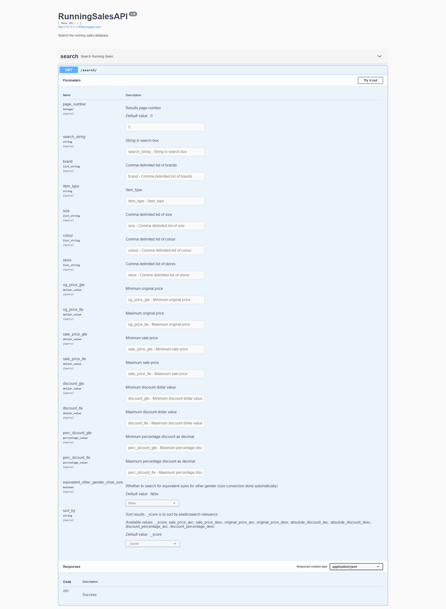

# RunningScraperAPI
REST API built using 'Flask Rest X' for retrieving data stored in Elasticsearch database (which was produced using [RunningScraper](https://github.com/MinuraSilva/RunningScraper)).  
Takes query arguments in URI and constructs Elasticsearch query automatically. See the Swagger page for how to construct a query.

# To Run
Startpoint: `api\running_sales_api.py`  
Requires python packages Flask Rest X and Elasticsearch DSL. Documentation not complete yet.

# Swagger Screenshot
